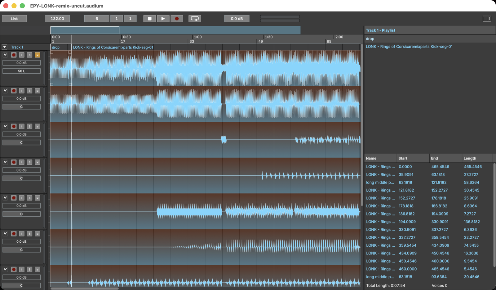

# The main window

The window has three areas: the **header bar** across the top, the **middle
area** with channel strips and the arrangement timeline, and the **right
panel** with regions and playlists. A separate floating **File Browser**
window is available from the *View* menu.

## Header bar

The header carries everything global:

- **Link** — enables Ableton Link, syncing tempo and transport with other
  Link-enabled software on your network.
- **Tempo** — the project tempo in BPM. All bar/beat positions derive from it.
- **Position** — the transport position in bars, beats and ticks; editable.
- **Play / Stop / Record / Loop** — the transport. **Space** toggles
  play/stop. Record arms the transport for recording (see
  [Recording](07-recording.md)).
- **Master meter and volume** — a stereo level meter and the master output
  gain.
- A button to show or hide the right panel.

## Channel strips

Each track shows its channels as strips on the left of the arrangement. Per
channel:

- **M** — mute, **S** — solo
- **Record** — arms the channel for recording
- **Monitor** — routes the channel's input to the output while armed
- a level meter, gain and pan controls
- **In** and **Out** — which hardware input feeds the channel and where its
  signal goes (see [Audio routing](#audio-routing))

Channel height is adjustable (micro / small / medium / large / huge) to fit
many channels on screen — set it per channel with the height combo on the
strip, or for the whole track by **right-clicking the track header** and
choosing a size from the **Waveform Size** submenu. The same track-header
menu also holds the **Show Analysis** toggles (see
[Analysis and Auto Edit](08-analysis-and-auto-edit.md)).

Right-clicking a channel offers **Copy selected channel(s) to new track**.

### Audio routing

The two small combos at the bottom of each strip list the channels of the
current audio device (as chosen in *Settings → Audio*).

- **In** picks the hardware input that feeds the channel when it is armed or
  monitoring. The default, **In (auto)**, uses the input with the same
  number as the channel's position in its track — the first channel of a
  track takes input 1, the second input 2, and so on.
- **Out** picks where the channel's signal goes. The default, **Main**, sends
  it through the pan control into the stereo main mix, which passes through
  the master volume and shows on the master meter. Choosing a device output
  instead sends the channel — after its own gain, unpanned — directly to
  that output, bypassing the main mix, master volume and master meter. Use
  this to feed an external mixer or a separate headphone or monitor output.

Routing changes are undoable and saved with the project. If you later open
the project with a device that lacks the chosen channel, the strip shows the
selection with a **!** marker and the channel stays silent (or cannot be
armed) until you pick an available channel or switch back to the original
device — the saved routing is kept.

## Arrangement

The timeline. Tracks run horizontally; clips are drawn with their waveforms
and can be dragged, trimmed and split. A bar/beat grid underlies everything
(snapping can be toggled), and analysis results — segment boundaries,
beats — can be displayed over the material.

Navigation: **Cmd++** / **Cmd+-** zoom, **←** / **→** page left and right,
*View → Follow Transport* (**Ctrl+F**) keeps the view on the playhead.

## Right panel

Two stacked lists, divided by a draggable resizer:

- **Regions** — every named region in the project. This is the pool of
  material you can place on the timeline.
- **Playlists** — the sequence of clips per track.

## File Browser

*View → Open File Browser* opens a floating file tree (starting in your
Music folder). Select one or more audio files and drag them into the
arrangement to import them.
