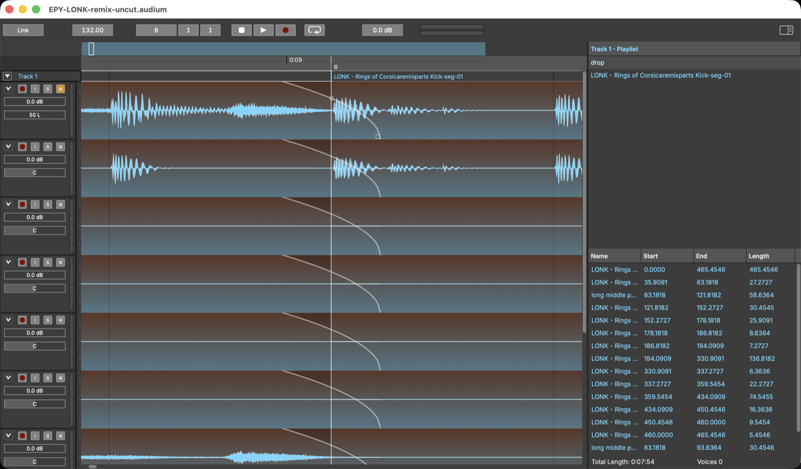

# Editing

All edits are undoable (**Cmd+Z** / **Cmd+Shift+Z**).

## Selecting

Click a clip to select it. Select a **time range** in the arrangement to
address a stretch of material — range selection drives *Create Region* and
range-based splitting. *Edit → Select All* (**Cmd+A**) and *Deselect All*
do what they say.

## Splitting

*Edit → Split* (**Cmd+E**):

- With **no range selected**, the clip under the playhead is cut in two at
  the playhead position — on every track that has a clip there.
- With a **range selected**, the clip is cut into up-to-three pieces: before,
  inside, and after the range.

Each piece gets its own freshly named region (numbered after the original),
and fades stay with the edge they belong to.

## Creating and managing regions

- *Create → Create Region…* (**Cmd+R**) names the selected range as a region.
  The clip containing the range is unchanged — the region is added to the
  pool for later use.
- Regions can be renamed in the Regions list.
- *Edit → Delete Unused Regions* clears out every region no clip uses.

## Moving, duplicating, deleting clips

- **Drag** a clip to move it along the timeline (snap to grid applies when
  enabled).
- **Cmd+D** duplicates the selected clip.
- **Delete** removes the selected clip from the timeline (the region and its
  audio remain).
- Drag a region from the Regions list into the arrangement to place a new
  clip of it.

## Clip gain and fades

Every clip carries its own dynamics:

- **Clip gain** — per-channel volume for just that clip, adjusted directly
  on the clip.
- **Fades** — drag the fade handles at a clip's edges to create fade-ins and
  fade-outs. The default curve is equal-power; the curve can be bent. Fade
  ramps may extend *beyond* the clip's edge — the fade then reads
  neighbouring source material, which is how two butting clips crossfade.

Crossfades at segment joints can also be created automatically by Auto Edit
(see [Analysis and Auto Edit](08-analysis-and-auto-edit.md)); their default
length and curve are configured in *Settings → Auto Edit*.

## Per-clip context menu

Right-click a clip for **Export…** — bounce just that clip to a WAV file
(see [Exporting audio](09-export.md)).

## Snap and zoom

The grid snaps drags to musical positions; *View → Zoom In / Zoom Out*
(**Cmd++** / **Cmd+-**) and paging (**←** / **→**) navigate, and *Follow
Transport* keeps the playhead in view.
