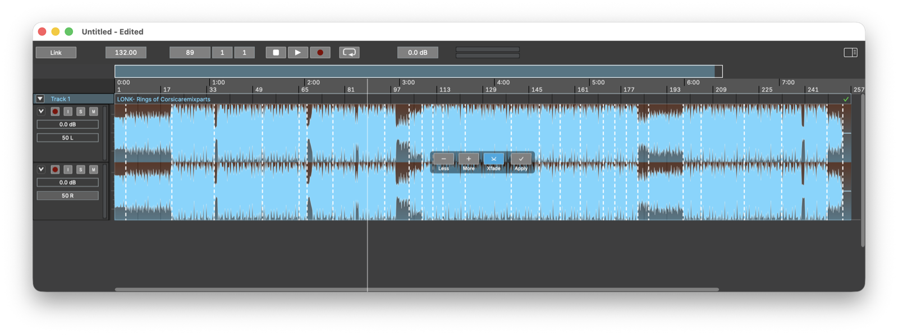

# Analysis and Auto Edit

Audionaut can listen to your material and use what it hears to cut and
arrange it. Analysis is powered by the [Essentia](https://essentia.upf.edu)
library; in builds without Essentia these features are unavailable.

## Analysis

Four analysis types are available (*Settings → Analysis*):

- **SBic** — segment boundaries (where the character of the audio changes)
- **Onsets** — note/event onsets
- **Beats (multifeature)** and **Beats (Degara)** — beat tracking

With *Analyse new audio files automatically* enabled, imported and recorded
audio is analysed in the background. Results are cached inside the project,
so analysis runs once per file. Auto Edit uses **SBic** and **Beats
(Degara)**.

## Auto Edit step 1 — Create Segments

Select a clip and choose *Edit → Auto Edit → 1. Create Segments…*
(**Cmd+1**). An overlay appears on the clip previewing the cut:

- **Less / More** — fewer or more segments (the preview realigns to analysed
  boundaries; the default granularity is 4 measures)
- **Xfade** — toggle crossfades at the joints
- **Apply** — perform the cut; **Esc** cancels the preview

Applying replaces the clip with its segments — each a named region placed
seamlessly where the clip was, with optional equal-power crossfades at every
joint. One undo restores the original clip.

Crossfade length and curve for these joints are set in *Settings → Auto
Edit*.

## Auto Edit step 2 — Assemble

*Edit → Auto Edit → 2. Assemble → Sequential…* (**Cmd+2**) or *Random…*
(**Cmd+3**) builds a new arrangement from the track's regions. Choose the
target length in the dialog; Audionaut lays out regions back-to-back —
in order, or shuffled — until the duration is reached.

Segments from *Create Segments* are the natural input, but Assemble works
with any regions on the track.

## Seeing the analysis

Analysis results can be displayed as overlays on a track's clips, so you can
check what the analysis found before cutting.

**Right-click the track header** and open the **Show Analysis** submenu: it
lists **SBic**, **Onsets**, **Beats** and **Beats (Degara)**, each a toggle
with a tick when currently shown. The setting is per track, so you can, say,
show segment boundaries on one track and beats on another.
