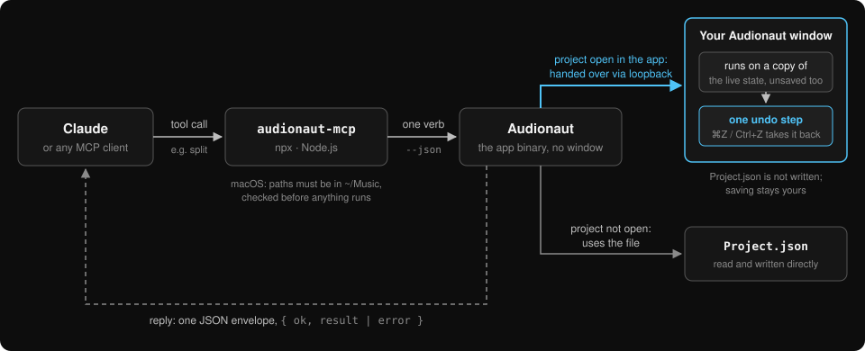

# The command line and AI agents

Everything the timeline can do is also available headlessly. Two front doors:

- **`audionaut-cli`** — a console binary (built with the test CMake project;
  see the repository [README](../../README.md) for building it).
- **The app itself** — running the Audionaut binary with a verb executes it
  headlessly and quits, even while a GUI instance is open. The binary is
  `/Applications/Audionaut.app/Contents/MacOS/Audionaut` on macOS,
  `Audionaut.exe` in `Program Files\Audionaut` on Windows, and `audionaut`
  (from the .deb) or the AppImage on Linux. This is what AI agents use.

<figure>
  
  <figcaption>What happens when an agent edits a project: each tool call runs one Audionaut command. If the project is open, your running app does the work and you get one undo step; otherwise the project file is edited directly.</figcaption>
</figure>

## Working on a project that is open in the app

You do not have to save, close, or otherwise get out of the way before handing
a project to an agent.

While Audionaut has a project open it serves commands for it, and a verb
addressed at that project is handed over instead of going to the file. The
command then acts on the document **as you currently see it**, unsaved changes
included. Its result arrives as a single entry in your undo history — labelled
after the verb, with the window title marked *Edited By Agent* — so ⌘Z takes it
back like any other edit. Nothing is written to `Project.json`; saving stays
yours to do.

Your own edits take precedence. If you change the project while a command is
running, its result is dropped and the agent is told to run it again rather
than have your work replaced. Commands are refused while you are recording,
and exports are refused while the transport is playing.

With no app holding the project, verbs read and write the project file exactly
as they always have.

If the app is holding a project but a command cannot reach it, the command
**fails** rather than falling back to the file — the file is missing whatever
you have not saved, and quietly writing over it is the one outcome worth
refusing. Set `AUDIONAUT_AGENT_ROUTING=0` to work on the file deliberately.

Something else may still write the project file — a script, an older build, or
a command you ran with routing off. If such a write lands while you have
unsaved edits it did not see, the app asks before reloading over them rather
than discarding your work.

Two files inside a package belong to the app and should be left alone:
`Autosave.json`, its crash-recovery snapshot, and `Host.json`, the marker
saying which process is holding the project.

One limit worth knowing on macOS: the app is sandboxed, and so is every
command it runs — whether it runs it for an open project or on its own. It can
reach your Music folder, but not anywhere else, so keep projects, the audio you
import and your export targets inside `~/Music` (for example in
`~/Music/Audionaut`). The MCP server below checks this before it starts a
command and says so with `sandbox_denied`. The developer build of
`audionaut-cli` has no such limit. Windows and Linux have none either.

## Verbs

```
info            project summary (tempo, tracks, clips) or raw project JSON
create          new empty project
import          add audio files at a position
export          offline bounce (whole project, a window, or one region)
analyze         run Essentia analysis and cache the results
auto-edit       segment a clip at analysed boundaries
assemble        build an arrangement from a track's regions
split           split clips at a timeline position
create-region   name a region from a timeline range
set-region      rename and/or retrim a region
remove-clip     remove clip(s) from the timeline
move-clip       move a clip to a new position or track
place-clip      place an existing region on the timeline
cleanup-regions delete every region no clip uses
clip-gain       set a clip's gain (linear or dB)
clip-fades      set a clip's fade lengths, offsets and curves
clip-speed      set a clip's speed (ratio, semitones or target length)
                and mode (--mode repitch|stretch, pitch-preserving)
remove-track    remove a whole track (channels, clips and regions)
remove-channel  remove one channel from a track
separate        split a clip into Drums/Bass/Other/Vocals tracks (Demucs)
```

Run `audionaut-cli --help` for each verb's options. Positions and durations
are musical by default — `--unit bars|beats|seconds|clocks`, bars and beats
1-based — so "split at bar 23" is literally `split song.audium --at 23`.

## Scripting contract

Every verb takes `--json`, which prints exactly one machine-readable result
envelope on stdout — `{"ok": true, "result": …}` or `{"ok": false,
"error": {"code": …, "message": …}}` — with all logging on stderr. Exit
codes: `0` success, `1` failed, `2` usage error, `3` feature unavailable in
this build.

Example session:

```
audionaut-cli split      song.audium --at 23
audionaut-cli create-region song.audium --name chorus --start 17 --end 25
audionaut-cli place-clip song.audium --region chorus --at 33
audionaut-cli clip-fades song.audium --region chorus --fade-in 1 --unit beats
audionaut-cli export     song.audium -o mix.wav --sample-rate 48000
audionaut-cli export     song.audium -o mix.flac   # lossless FLAC, 16/24 bit
audionaut-cli export     song.audium -o mix.ogg --bitrate 160   # Ogg Vorbis
audionaut-cli export     song.audium -o mix.mp3 --bitrate 320   # MP3 (LAME)
```

## AI agents (MCP)

`audionaut-mcp` is an MCP server that exposes every verb as a tool, so Claude
and any other MCP-capable agent can inspect and edit projects
conversationally. It runs the verbs through your installed Audionaut app, so
all you need besides the app is [Node.js](https://nodejs.org) 18 or later.

**Claude Code:**

```
claude mcp add audionaut -- npx -y audionaut-mcp
```

**Claude Desktop** — add this to `claude_desktop_config.json` (Settings ▸
Developer ▸ Edit Config) and restart Claude:

```json
{
  "mcpServers": {
    "audionaut": {
      "command": "npx",
      "args": ["-y", "audionaut-mcp"]
    }
  }
}
```

On Windows, if Claude Desktop cannot start `npx`, use `"command": "cmd"` with
`"args": ["/c", "npx", "-y", "audionaut-mcp"]`.

Then just ask, for example *"split the clip in ~/Music/Audionaut/Demo
Project.audium every 16 bars and put every second part on a new track"*. Keep
the project open in Audionaut to watch the edits arrive; each one is a single
undo step, as described above.

On macOS, keep the project and its audio in your Music folder (see the sandbox
note above). To see which Audionaut the server found and whether it answers:

```
npx -y audionaut-mcp --check
```

Audionaut 1.6.3 or later is recommended; 1.6.2 works on macOS and Linux, and
may not answer agents on Windows.
`separate` needs the Demucs model, which you download once in the app — see
[Stem separation](13-stem-separation.md).

When an agent runs into something the tools cannot do, or into a bug, it can
send a feature request or bug report to the maintainer as a GitHub issue — it
tells you when it does. More in the server's
[README](../../Tools/audionaut-mcp/README.md), including how to use a
developer build of `audionaut-cli` instead of the app.

## Privacy

CLI invocations follow the desktop app's analytics consent — see
[Privacy](12-privacy.md). `AUDIONAUT_DISABLE_ANALYTICS=1` switches CLI
reporting off regardless, which is recommended for CI.
