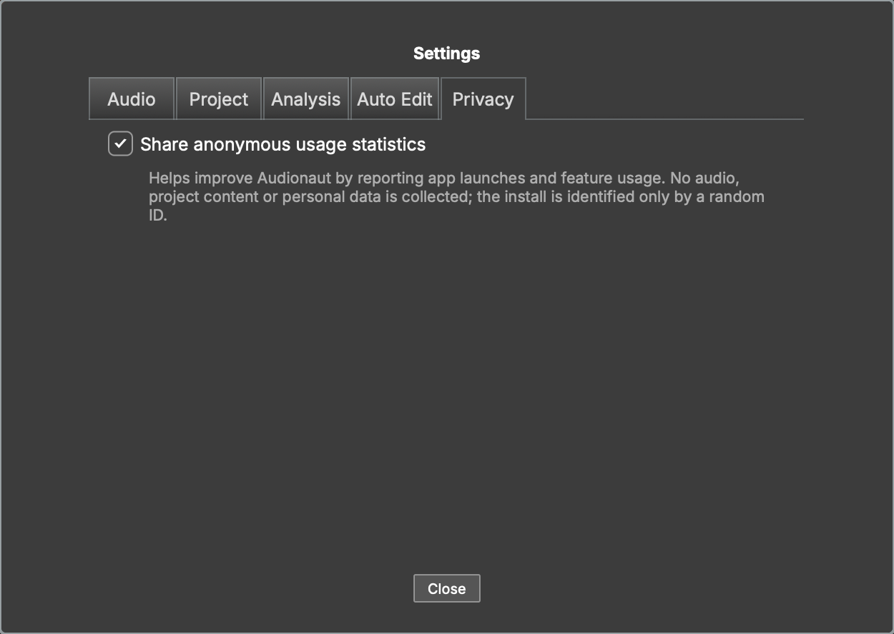

# Privacy

Audionaut can report anonymous usage statistics to help improve the app.
This is **strictly opt-in**: nothing is ever sent unless you agree.

## Consent

On first launch Audionaut asks once. You can change your answer anytime with
the *Share anonymous usage statistics* toggle in **Settings → Privacy** —
the change takes effect immediately.

## What is collected — and what is not

When enabled, Audionaut reports events such as app launches and which
features are used (for example, which menu command or CLI verb ran). Each
event carries only the event name and its context (an app version, a verb
name, an exit code).

Not collected, ever:

- audio or any project content
- file names or paths
- personal data or hardware identifiers

The install is identified by a random ID generated on your machine; it links
events from the same installation and nothing else. Events are sent to
Google Analytics; events that cannot be delivered (offline) are stored
locally and retried later.

## The command line follows the app

`audionaut-cli` obeys the same consent: it reports a single event per
invocation (the verb and its exit code) **only** if consent was granted in
the app, and never asks on its own. Setting the environment variable
`AUDIONAUT_DISABLE_ANALYTICS=1` silences the CLI regardless of consent —
useful in CI and scripts. Nothing can make the CLI report while consent is
denied or undecided.

## Where your choice is stored

The consent flag (`UsageStatsEnabled`) lives in Audionaut's ordinary
preferences store:

- **macOS** — the app container:
  `~/Library/Containers/com.voltmer-systems.audionaut/Data/Library/Preferences/`
- **Windows** — the registry under
  `HKEY_CURRENT_USER\Software\voltmer-systems\Audionaut`
- **Linux** — `~/.config/voltmer-systems/Audionaut.settings`

Deleting the key returns Audionaut to the undecided state, and it will ask
again on the next launch.
